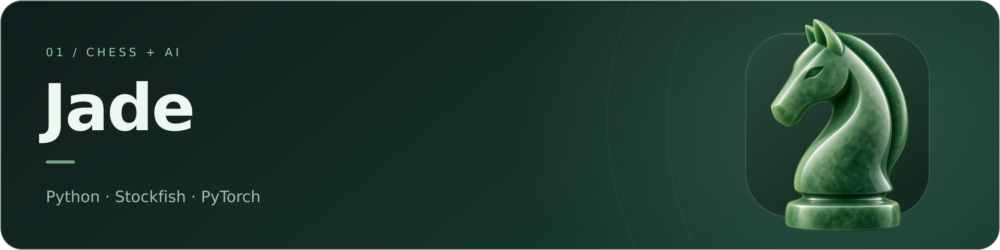

# Jade Chess AI

**Español** | [English](README.en.md)

Juega al ajedrez contra una IA que combina Stockfish con estilos humanos. Jade es un proyecto educativo y experimental de **Manu**. Versión **2.2.1**.

## Probar Jade

1. **Abre el cuaderno** con el botón de arriba e inicia sesión en Google si se solicita.
2. **Prepara la sesión:** ejecuta las celdas **1 → 2 → 3 → 3B → 4**, en ese orden. En la celda 2 elige el ritmo y si quieres guardar en Drive.
3. **Juega:** ejecuta la celda **6**, elige color y perfil, y usa el tablero.
4. **Guarda:** ejecuta la celda **7** antes de terminar si quieres conservar la memoria con Drive activo.

**Para tu primera partida no necesitas entrenar una red, descargar datos ni subir los archivos `.py`.** El cuaderno contiene el programa completo. Puedes empezar con CPU; la GPU es opcional para el entrenamiento neuronal.

En cada sesión nueva, vuelve a ejecutar las celdas de preparación. Usa un único cuaderno activo por carpeta de memoria. Los perfiles 1200–1600 son objetivos de estilo; no representan un ELO medido.

## Si quieres ir más allá

- **Analizar un PGN:** celda **8**; informes guardados en **8B**.
- **Entrenar, usar la consola o modificar el código:** [README avanzado](docs/README.advanced.md). Incluye toda la documentación técnica anterior.
- **Descargar el cuaderno:** [archivo del repositorio](Jade_Colab_2_2_1.ipynb) o [release 2.2.1](https://github.com/LogicGrove/jade-chess-ai/releases/tag/v2.2.1).

Antes de entrenar en Colab, revisa [sus condiciones](https://research.google.com/colaboratory/faq.html): el entrenamiento de ajedrez está restringido en entornos gratuitos sin saldo positivo de unidades de cómputo. La disponibilidad de GPU y la duración de las sesiones varían.

¿Algo falla? Abre un Issue indicando la celda, el error y tu entorno, sin datos personales. [Cómo contribuir](docs/CONTRIBUTING.md).

Código y documentación: [GPL-3.0-or-later](LICENSE). [Créditos y licencias de terceros](docs/THIRD_PARTY_NOTICES.md).
